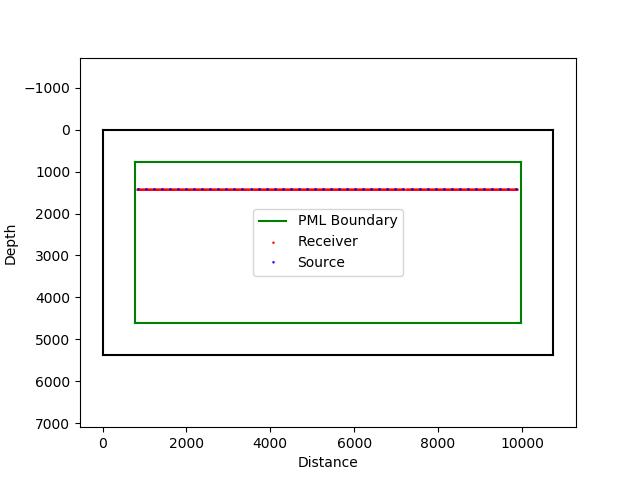

# Full Waveform Inversion

In this example, we perform full-waveform inversion (FWI) with `FwiFlow`, using high level APIs. The core of the FWI module is wrapped in the [`FWI`](@ref) struct. 

To begin with, let us construct a `FWI` struct using the same parameters in [this article](./fwi_lowlevel.md). 

**Setting the geometry**
```julia
using FwiFlow
using PyCall
using LinearAlgebra
using DelimitedFiles
using MAT
np = pyimport("numpy")

oz = 0.0 
ox = 0.0
dz_orig = 24.0 
dx_orig = 24.0 
nz_orig = 134 
nx_orig = 384 
dz = dz_orig/1.0
dx = dx_orig/1.0
nz = Int64(round((dz_orig * nz_orig) / dz));
nx = Int64(round((dx_orig * nx_orig) / dx))
dt = 0.0025
nSteps = 2000

# source and receiver locations
ind_src_x = collect(4:8:384)
ind_src_z = 2ones(Int64, size(ind_src_x))
ind_rec_x = collect(3:381)
ind_rec_z = 2ones(Int64, size(ind_rec_x))

fwi = FWI(nz, nx, dz, dx, nSteps, dt; 
    ind_src_x = ind_src_x, ind_src_z = ind_src_z, ind_rec_x = ind_rec_x, ind_rec_z = ind_rec_z)
```

We can also visualize the geometry setting using [`plot`](@ref)
```julia
plot(fwi)
```


Next, we load the source time function and use it to do forward simulation 
```julia
stf = matread("$(DATADIR)/sourceF_4p5_2_high.mat")["sourceF"][:]
cp = Float64.(reshape(reinterpret(Float32,read("$DATADIR/Model_Cp_true.bin")), (fwi.nz_pad, fwi.nx_pad)))|>Array
cs = zeros(fwi.nz_pad, fwi.nx_pad)
ρ = 2500.0 .* ones(fwi.nz_pad, fwi.nx_pad)
λ, μ = velocity_to_moduli(cp, cs, ρ)
shot_ids = [1]
obs = compute_observation(fwi, λ, μ, ρ, stf, shot_ids, gpu_id=0, is_padded=true)
```

Finally, we perform the computation and plot `obs`
```julia
sess = Session()
obs_ = run(sess, obs)
imshow(obs_, vmax=2000, vmin=-2000, extent=[0, nx*dx, dt*(nSteps-1), 0])
xlabel("Receiver Location (m)")
ylabel("Time (s)")
colorbar()
set_cmap("gray")
```