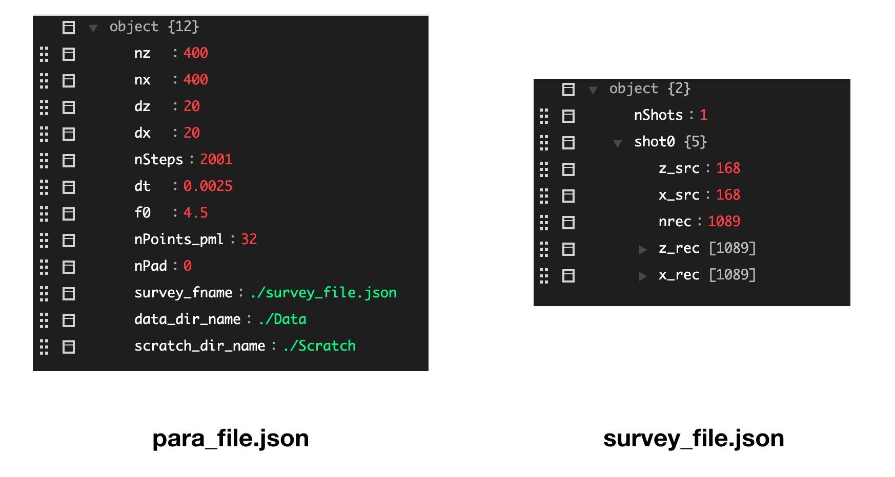

# Full Waveform Inversion using Low Level APIs

In this example, we perform full-waveform inversion (FWI) with `FwiFlow`. For explanation of FWI, see the [documentation](https://wayneweiqiang.github.io/ADSeismic.jl/dev/forward_simulation/) here. 

First we load all necessary packages
```julia
using FwiFlow
using PyCall
using LinearAlgebra
using DelimitedFiles
using MAT
np = pyimport("numpy")
```


We specify the parameters for the computational domain and numerical methods. The computational domain is shown below


```julia
oz = 0.0 
ox = 0.0
dz_orig = 24.0 
dx_orig = 24.0 
nz_orig = 134 
nx_orig = 384 
dz = dz_orig/1.0
dx = dx_orig/1.0
nz = Int64(round((dz_orig * nz_orig) / dz));
nx = Int64(round((dx_orig * nx_orig) / dx))
dt = 0.0025
nSteps = 2000
para_fname = "para_file.json"
survey_fname = "survey_file.json"
data_dir_name = "Data"
```


We set the PML width, padding width (optional; the padding is for performance, see [`padding`](@ref)) and the mask, which removes the effect of sources and makes inversion more stable. 
```julia
nPml = 32
nPad = 32 - mod((nz+2*nPml), 32)
nz_pad = nz + 2*nPml + nPad
nx_pad = nx + 2*nPml
Mask = zeros(nz_pad, nx_pad)
Mask[nPml+1:nPml+nz, nPml+1:nPml+nx] .= 1.0
Mask[nPml+1:nPml+10,:] .= 0.0
mask = constant(Mask)
mask_neg = constant(1.0 .- Mask)
```

The source and receiver indices are given by
```julia
ind_src_x = collect(4:8:384)
ind_src_z = 2ones(Int64, size(ind_src_x))
ind_rec_x = collect(3:381)
ind_rec_z = 2ones(Int64, size(ind_rec_x))
```

Next, we load source time functions (`stf_load`) from the file. 
```julia
stf_load = matread("$(DATADIR)/sourceF_4p5_2_high.mat")["sourceF"]
stf_array = repeat(stf_load, length(ind_src_z), 1)
```
Each source time function has the following profile


We load the true P-wave, S-wave and densities to generate synthetic observation data
```julia
cp_true_pad = reshape(reinterpret(Float32,read("$DATADIR/Model_Cp_true.bin"))          , (nz_pad, nx_pad))
cs_true_pad = zeros(nz_pad, nx_pad)
den_true_pad = 2500.0 .* ones(nz_pad, nx_pad)

tf_cp_pad = Variable(cp_true_pad, dtype=Float64) # original scale as 
tf_cs_pad = constant(cs_true_pad, dtype=Float64)
tf_den_pad = constant(den_true_pad, dtype=Float64)

function vel2moduli(cp,cs,den)
    lambda = (cp^2 - 2.0 * cs^2) .* den / 1e6
    mu = cs^2 .* den / 1e6
    return lambda, mu
end
tf_lambda_inv_pad, tf_mu_inv_pad = vel2moduli(tf_cp_pad, tf_cs_pad, tf_den_pad)
```

We use [`paraGen`](@ref) and [`surveyGen`](@ref) to generate parameter files
```julia
f0 = 4.5
paraGen(nz_pad, nx_pad, dz, dx, nSteps, dt, f0, nPml, nPad, para_fname, survey_fname, data_dir_name)
surveyGen(ind_src_z, ind_src_x, ind_rec_z, ind_rec_x, survey_fname)
```
At this point, we should be able to see two files in the current directory


Finally we execute the forward wave equation and save the observation data to files. In the following script, we explicitly specify the ID of GPU where the operator is executed. 
```julia
tf_shot_ids = collect(0:length(ind_src_z)-1)
dummy = fwi_obs_op(tf_lambda_inv_pad, tf_mu_inv_pad, tf_den_pad, stf_array, 0, tf_shot_ids, para_fname) # use GPU:0
sess = Session(); init(sess);
run(sess, dummy)
```

In the `Data` folder, there will be 47 `Shot*.bin` files. We can visualize the result with the following script
```julia
A=read("Data/Shot10.bin");imshow(reshape(reinterpret(Float32,A),(nSteps ,length(ind_rec_z))), aspect="auto", vmax=2000, vmin=-2000, extent=[0, nx*dx, dt*(nSteps-1), 0])
xlabel("Receiver Location (m)")
ylabel("Time (s)")
colorbar()
set_cmap("gray")
```


 
We now consider the inversion problem: assume that we do not known the P-wave velocity. We mark it as independent variable to be update using `Variable`. Additionally, for better coalesced memory access on GPU, we pad the variables to multiples of 32 in the $z$ direction.
```julia
cs_init_pad = zeros(nz_pad, nx_pad)
den_init_pad = 2500.0 .* ones(nz_pad, nx_pad)
cp_init_pad = reshape(reinterpret(Float32,read("$DATADIR/Model_Cp_init_1D.bin")), (nz_pad, nx_pad))
tf_cp_inv = Variable(cp_init_pad[nPml+1:nPml+nz, nPml+1:nPml+nx], dtype=Float64) # original scale as 
tf_cs_inv = constant(cs_init_pad[nPml+1:nPml+nz, nPml+1:nPml+nx], dtype=Float64)
tf_den_inv = constant(den_init_pad[nPml+1:nPml+nz, nPml+1:nPml+nx], dtype=Float64)
tf_cp_ref_pad = constant(cp_init_pad, dtype=Float64) # original scale as 
tf_cs_ref_pad = constant(cs_init_pad, dtype=Float64)
tf_den_ref_pad = constant(den_init_pad, dtype=Float64)
tf_cp_inv_pad, tf_cs_inv_pad, tf_den_inv_pad = padding(tf_cp_inv, tf_cs_inv, 
    tf_den_inv, nz_orig, nx_orig, nz, nx, nPml, nPad)
```

Likewise, to remove the effect of extreme values close to the sources, we use masks
```julia
tf_cp_msk_pad = tf_cp_inv_pad .* mask + tf_cp_ref_pad .* mask_neg
tf_cs_msk_pad = tf_cs_inv_pad .* mask + tf_cs_ref_pad .* mask_neg
tf_den_msk_pad = tf_den_inv_pad .* mask + tf_den_ref_pad .* mask_neg
tf_lambda_inv_pad, tf_mu_inv_pad = vel2moduli(tf_cp_msk_pad, tf_cs_msk_pad,tf_den_msk_pad)
```

The inversion can be done in parallel in multi-GPU machines. This is done by specifying the GPU IDs for different `fwi_op`. 
```julia
loss = constant(0.0)
nGpus = length(use_gpu())
shot_id_points = Int32.(trunc.(collect(LinRange(0, length(ind_src_z)-1, nGpus+1))))

loss = constant(0.0)
for i = 1:nGpus
    global loss
    tf_shot_ids = collect(shot_id_points[i]:shot_id_points[i+1])
    loss += fwi_op(tf_lambda_inv_pad, tf_mu_inv_pad, tf_den_inv_pad, 
            stf_array, i-1, tf_shot_ids, para_fname)
end
```

Finally, we trigger BFGS optimizer with two lines of codes. 
```julia
sess = Session(); init(sess)
BFGS!(sess, loss)
```

Here is a snapshot of multi-GPU execution. Note we have only used approximately 2% of total memory, which means we can actually places about 50 times the current number of sources on each GPU! 
